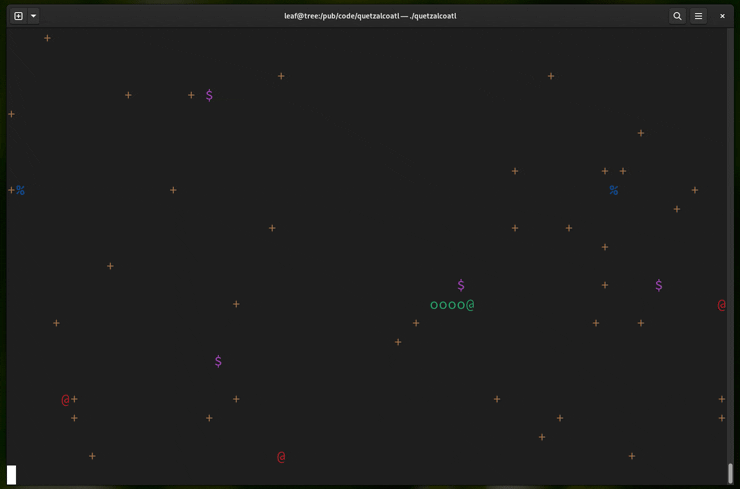

# Quetzalcoatl
Quetzalcoatl is a variant of the classic snake game, written in Free Pascal and available for Unix operating systems.

It features a text user interface, customizable key bindings, and can be played in the terminal.



## Installation
Binary downloads of the Quetzalcoatl game can be found on [the Releases page](https://github.com/bimzhanovt/quetzalcoatl/releases).

To compile the program from source, you will need to install the `fpc` compiler and `make`. Then, give the following commands:

```sh
$ cd src/
$ make
$ ./quetzalcoatl
```

## License
Quetzalcoatl is free software: you can redistribute it and/or modify
it under the terms of the GNU General Public License as published by
the Free Software Foundation, either version 3 of the License, or
(at your option) any later version.

This program is distributed in the hope that it will be useful,
but WITHOUT ANY WARRANTY; without even the implied warranty of
MERCHANTABILITY or FITNESS FOR A PARTICULAR PURPOSE.  See the
GNU General Public License for more details.

You should have received a copy of the GNU General Public License
along with this program.  If not, see <http://www.gnu.org/licenses/>.
